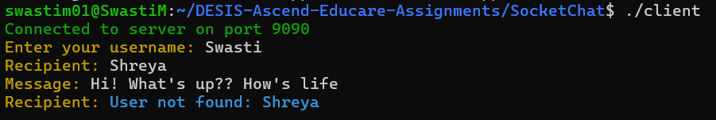

# DESIS-Ascend-Educare-Assignments
This is a compilation of my working of all the assignments given by the D.E. Shaw &amp; Co group under DESIS Ascend Educare 2024.

# Assignment Notes:
- [Assignment 1: Implement a BookStore Inventory Management System](#bookstore-inventory-management-system)
## Assignment 1. BookStore Inventory Management System

## Overview
The **BookStore Inventory Management System** is designed manage the inventory of books and magazines efficiently. It includes functionality for adding books/magazines to the inventory, managing stock, processing sales, and calculating profits. The system features different roles (Store Manager, Cashier, Customer) and allows each role to perform specific tasks related to inventory management.

## Features
- **Inventory Management**: 
  - Add books/magazines to the inventory with detailed attributes (title, author, publication, price, etc.)
  - Increase or decrease the stock levels of books/magazines.
  - Track available stock of books and magazines.
  - View a list of all available books and magazines with details like price and stock.

- **Profit Calculation**: 
  - For each book and magazine, profit is calculated based on the difference between selling price and cost price.

- **Sales Processing**:
  - Cashier can sell books and magazines.
  - Takes into account the case if the stock is insufficient.

- **People classes**:
  - **Store Manager**: Manages inventory by adding books and magazines.
  - **Cashier**: Handles sales transactions (books and magazines).
  - **Customer**: Views inventory and makes purchasing decisions.

## Classes and Their Functionality

### 1. **Book**
Methods:
  - `addBookCount`: Add to the stock of the book.
  - `subtractBookCount`: Subtract from the stock of the book.
  - `calculateProfit`: Calculate profit per book.
  - `display`: Display book details.
  - `getCount`: Display book count.
  - `getTitle`: Display book title.

### 2. **Magazine**

Methods:
  - `addMagazineCount`: Add to the stock of the magazine.
  - `subtractMagazineCount`: Subtract from the stock of the magazine.
  - `calculateProfit`: Calculate profit per magazine.
  - `display`: Display magazine details.
  - `getCount`: Display magazine count.
  - `getTitle`: Display magazine title.

### 3. **Employee (Parent Class)**
This is the parent class for employees (Store Manager and Cashier). It includes basic employee details such as:
  - `name`: Name of the employee.
  - `email`: Contact email of the employee.
  - `phoneNo`: Contact number of the employee.

### 4. **StoreManager (Inherited from Employee)**
The store manager can:
  - Add books and magazines to the inventory.

### 5. **Cashier (Inherited from Employee)**
The cashier can:
  - Sell books and magazines, adjusting the inventory accordingly.
  
### 6. **Customer**
A customer can:
  - View the inventory of books and magazines with prices and stock information.

## Example Usage

```cpp
int main() {
    vector<Book> bookInventory;
    vector<Magazine> magazineInventory;

    Book book1("Harry Potter", "J.K. Rowling", "Penguin", "A1234", 900.00, 750.00, 100);
    Book book2("Matilda", "Roald Dahl", "Penguin", "B5678", 400.00, 250.00, 50);
    Magazine magazine1("National Geographic", "National Geographic Society", "March 2024", "C1234", 200.00, 100.00, 200);
    Magazine magazine2("Time", "Time USA, LLC", "April 2024", "D5678", 300.00, 200.00, 150);

    StoreManager manager("Swasti", "swasti.mishra@desisascendeducare.in", "9730587031");
    Cashier cashier("Shreya", "shreya.ojha@gmail.com", "9277352712");

    manager.addBook(bookInventory, book1);
    manager.addBook(bookInventory, book2);
    manager.addMagazine(magazineInventory, magazine1);
    manager.addMagazine(magazineInventory, magazine2);

    Customer customer("Rahul", "rahul282@gmail.com", "1234567890");
    customer.viewInventory(bookInventory, magazineInventory);

    cashier.sellBook(bookInventory[0], 10); // Sell 10 copies of Harry Potter
    cashier.sellMagazine(magazineInventory[1], 20); // Sell 20 copies of Time magazine

    customer.viewInventory(bookInventory, magazineInventory);

    for (const auto& book : bookInventory) {
        cout << "Book: " << book.getTitle() << " - Profit: ₹" << book.calculateProfit() << "\n";
    }
    for (const auto& magazine : magazineInventory) {
        cout << "Magazine: " << magazine.getTitle() << " - Profit: ₹" << magazine.calculateProfit() << "\n";
    }
    return 0;
}
```

### Output for above example usage:

